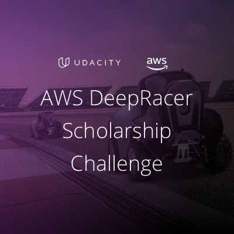

# **Paul Standley**

## AWS_deep_racer

### [Must Read](https://medium.com/@autonomousracecarclub/how-to-run-deepracer-locally-to-save-your-wallet-13ccc878687)

### [Supervised vs. Unsupervised Learning](https://towardsdatascience.com/supervised-vs-unsupervised-learning-14f68e32ea8d)

### [Intro to Machine Learning free course](https://www.udacity.com/course/intro-to-machine-learning--ud120)

### [Introduction to Machine Learning Nanodegree or Machine Learning Engineer Nanodegree programs](https://www.udacity.com/course/machine-learning-engineer-nanodegree--nd009t)
